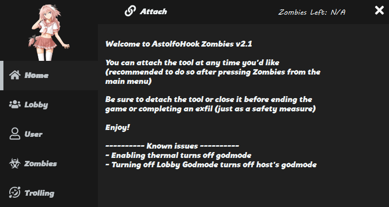
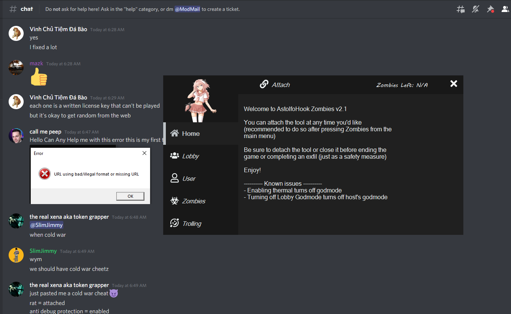

# Call Of Duty Cold War Zombies Tool

This tool was made for multiple groups within the call of duty modding community. Since I never really had any interest in this I have decided to release the source code in case anyone is into this kind of stuff and wants to create their own tool. Tool is written completely in C# as it was the easiest solution for dealing with reading and writing to memory with a GUI for users to deal with without integrating [ImGui](https://github.com/ocornut/imgui) to a C++ project.

---

# Whats Included

### Misc Functions

-   Hook Function (hook into the game)
-   Zombie Counter (how many zombies are left in the current round)
-   Memory Class (written mostly by my guy [Blazn](https://github.com/blazn420) with some modifications by yours truly to get certain functions to work the way I'd like)

### Lobby Functions

-   God Mode (for entire lobby or individual player within lobby)
-   Infinite Money (for entire lobby or individual player within lobby)
-   Infinite Ammo (for entire lobby or individual player within lobby)
-   Super Speed (for entire lobby or individual player within lobby)
-   Thermal Vision
-   Select custom weapon for individual within lobby

### User Functions

-   God Mode
-   Infinide Money
-   Infinite Ammo
-   Freeze Player (freeze yourself for fun)
-   Thermal Vision
-   Select custom weapon
-   Teleport (host and any players within the lobby)

### Zombies Functions

-   Insta Kill
-   Follow the Leader (zombies follow host around wherever they go using host player vector location)
-   Critial Kills Only (all kills count as crit kills)
-   Teleport Zombies To Crosshair (using Euler's Angles for Aerospace to calculate crosshair location)
-   Teleport Zombies To Me (teleport all zombies to host location)

### Trolling Functions (for all players in lobby except for host)

-   Send To Jail (send user to coordinates deep below the map without their gun and freeze their movements)
-   Take Gun (remove players gun)
-   Freeze Player (freeze player in current x,y,z position)
-   Send To Space (shoots player to the moon)
-   Kick (kicks player from game)
-   Bring To Me (brings player to host location)

Most of these offsets are probably outdated based on the current Cold War version as I have not kept it up to date (since I have no interest). If you would like to update the offsets it is definitely doable and the tool should be function properly with the updated offsets.

### Created For

The tool was created for multiple groups before I found that it had been leaked to outside sources to have rats or loggers attached (part of the reason I felt releasing the code was necessary). This list includes:

-   BigK
-   AlphaHook
-   AstolfoHook

# Things to be aware of

This source has been stolen by people with malicious intent. Please be aware if you see anthing that looks remotely to close the photo at the top (see picture below of proof I was sent by a friend of the stolen code with malicious intent)

